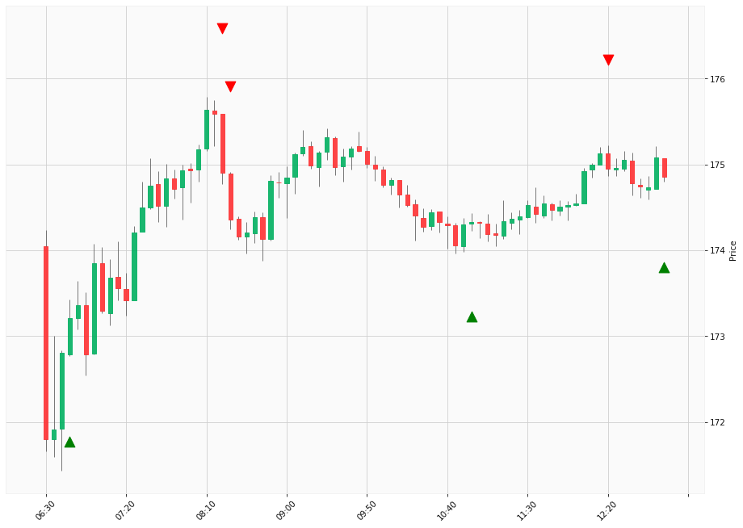

# Trading Summary for 2024-05-16

Percents are based off entry time.

Negative moves on shorts make money.

EOD is 12:55 pm

| Time In | Time Out | Time Delta |    | In Indicators | Out Indicators | Percent Move |    | Price In | Price Out | Dollar Move |
| ------- | -------- | ---------- | -- | ------------- | -------------- | ------------ | -- | -------- | --------- | ----------- |
| 06:45:00 | 08:20:00 | 01:35:00 | | Long HLT 213 Long HLT 333 Long HLT 602 | Short HLT 613 | 0.98 % | | $173.21 | $174.90 | $1.69 |
| 08:20:00 | 10:55:00 | 02:35:00 | | Short HLT 613 | Long HLT 203 | -0.33 % | | $174.90 | $174.33 | $-0.57 |
| 08:25:00 | 10:55:00 | 02:30:00 | | Short HLT 304 | Long HLT 203 | -0.02 % | | $174.36 | $174.33 | $-0.03 |
| 10:55:00 | 12:20:00 | 01:25:00 | | Long HLT 203 | Short HLT 646 | 0.36 % | | $174.33 | $174.95 | $0.62 |
| 12:20:00 | 12:55:00 | 00:35:00 | | Short HLT 646 | Long Day End Short Day End | -0.05 % | | $174.95 | $174.86 | $-0.09 |
|  |  |  |  |  |  |  | |  |  |  |
| Totals: |  |  |  |  |  | 1.73 % | |  |  | $3.00 |