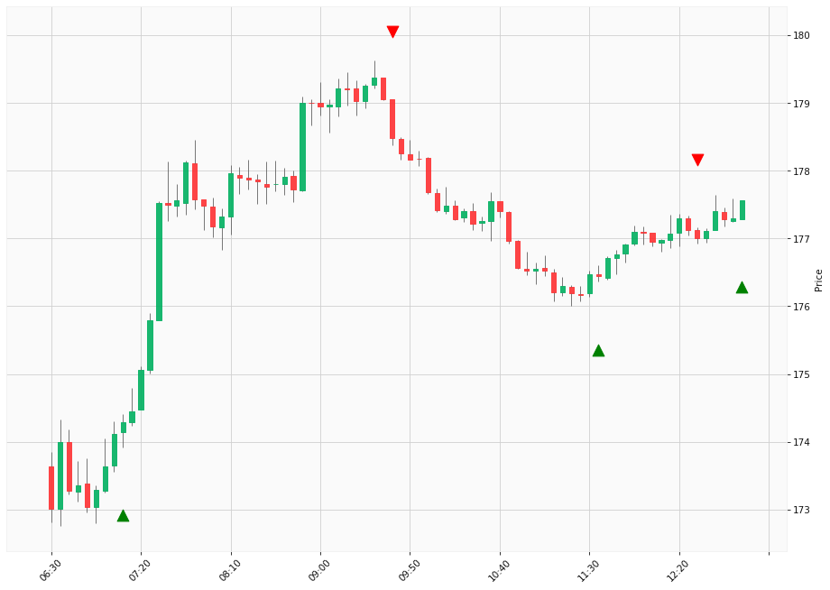

# Trading Summary for 2024-05-17

Percents are based off entry time.

Negative moves on shorts make money.

EOD is 12:55 pm

| Time In | Time Out | Time Delta |    | In Indicators | Out Indicators | Percent Move |    | Price In | Price Out | Dollar Move |
| ------- | -------- | ---------- | -- | ------------- | -------------- | ------------ | -- | -------- | --------- | ----------- |
| 07:10:00 | 09:40:00 | 02:30:00 | | Long HLT 304 | Short HLT 105 Short HLT 108 Short HLT 111 Short HLT 203 Short HLT 235 Short HLT 238 Short HLT 303 Short HLT 305 Short HLT 309 Short HLT 344 Short HLT 345 Short HLT 347 Short HLT 410 Short HLT 648 | 2.40 % | | $174.29 | $178.48 | $4.19 |
| 09:40:00 | 11:35:00 | 01:55:00 | | Short HLT 105 Short HLT 108 Short HLT 111 Short HLT 203 Short HLT 235 Short HLT 238 Short HLT 303 Short HLT 305 Short HLT 309 Short HLT 344 Short HLT 345 Short HLT 347 Short HLT 410 Short HLT 648 | Long HLT 203 Long HLT 344 Long HLT 410 | -1.14 % | | $178.48 | $176.44 | $-2.04 |
| 11:35:00 | 12:30:00 | 00:55:00 | | Long HLT 203 Long HLT 344 Long HLT 410 | Short HLT 203 | 0.32 % | | $176.44 | $177.01 | $0.57 |
| 12:30:00 | 12:55:00 | 00:25:00 | | Short HLT 203 | Long Day End Short Day End | 0.32 % | | $177.01 | $177.57 | $0.56 |
|  |  |  |  |  |  |  | |  |  |  |
| Totals: |  |  |  |  |  | 3.55 % | |  |  | $6.24 |