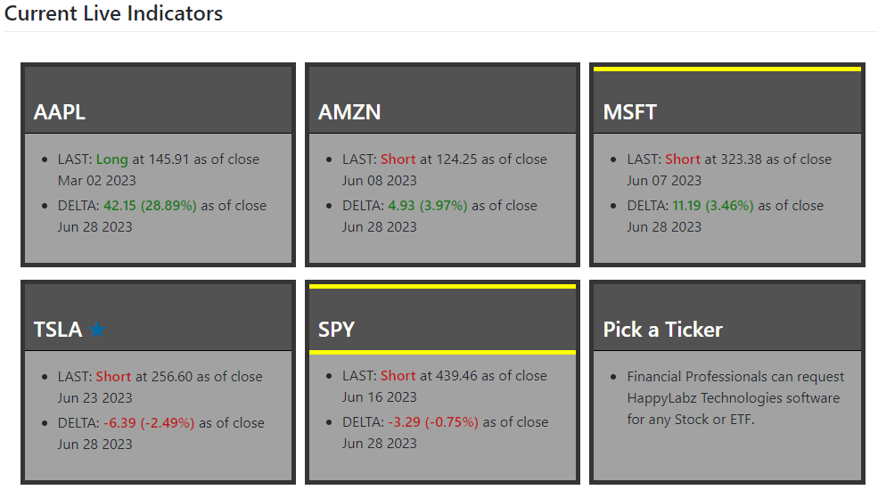
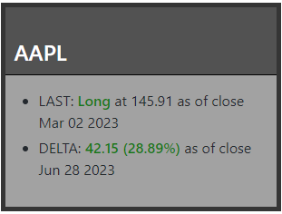
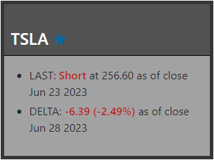
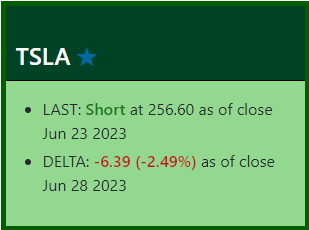
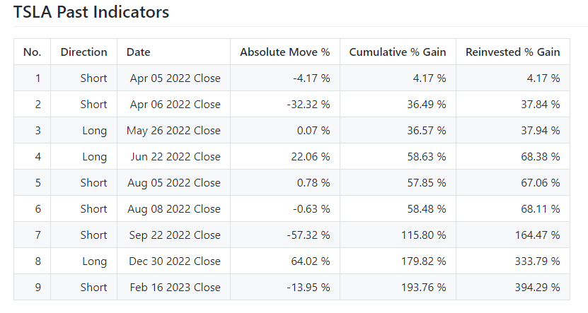

<link rel="stylesheet" href="how_to_use.css" />

      <h1>HappyLabz Technologies: Technically Timing Trades</h1>
      <h2>How to Use</h2>

<h2>HappyLabz Hub</h2>

  

    On the Home Screen, you'll encounter 'Ticker Boxes', each labeled with
    their respective stock or ETF ticker. These ‘Ticker Boxes’ display current 
    HappyLabz Technologies algorithmic indicator information and serve as hyperlinks that
    redirect you to sub-pages packed with additional information about the
    particular stock or ETF.
  

  

<h2>Boxes</h2>

  

    Each box displays essential information about a stock or ETF as analyzed
    by HappyLabz Technologies software.
  

  
  <ul class="descriptList">
    <li>Title: Name of Stock or ETF.</li>
    <li>
      LAST: Signifies the date and direction of the most recent algorithmic
      indicator. The color of the text aligns with the direction.
    </li>
    <li>
      DELTA: This represents the total amount of price movement in the stock
      since the last algorithmic indicator, along with the percentage change
      between that date and the current closing price.
    </li>
     
    

      When the colors of the LAST and DELTA text match, it implies that the
      algorithm and subsequent price movement are in agreement.
    

  </ul>
  

    The Ticker Boxes are typically GRAY, a color that signifies the absence
    of a current daily indicator and that the LAST algorithm is in active
    operation. When the HappyLabz software algorithm anticipates an upcoming trend
    shift, it interacts with the website, triggering a color transformation
    in the corresponding Ticker Box. The Ticker Box turns GREEN or RED,
    symbolizing the direction that the algorithm signals the stock or ETF is
    most likely to move.
  

  
  
  

  

    The LAST and DELTA data points are refreshed two hours after each
    trading day's closing. A Ticker Box retains its GREEN or RED for 24
    hours following an algorithmic prediction, after which it reverts to
    GRAY. Despite the color change, the DELTA continues to be updated
    daily.
  

<h2>HLT Past Results</h2>

  

    For a deeper dive into past trades, click the ticker title within a
    Ticker Box. This will direct you to a sub-page offering a detailed view
    of the past year's indicators, percentage moves, comparative results,
    and associated price charts. For instance, the TSLA sub-page currently
    displays this type of information.
  

  
  
  
  
  

    At HappyLabz, our dedicated team is constantly innovating, crafting and
    refining algorithms for an extensive range of stocks and ETFs. To gain
    insights into how our technology could be of benefit to you, we invite
    you to email us to arrange for a personalized demonstration tailored to
    the specific securities that pique your interest.
  

