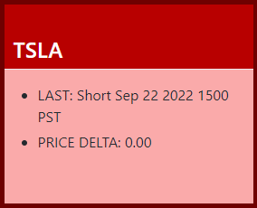
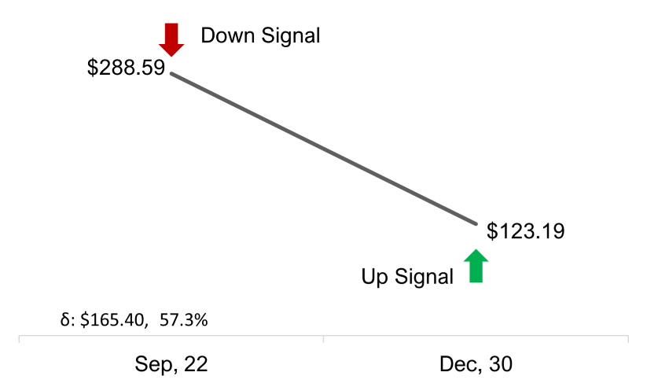
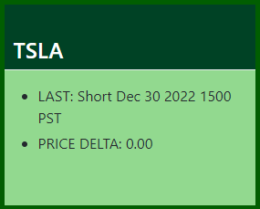
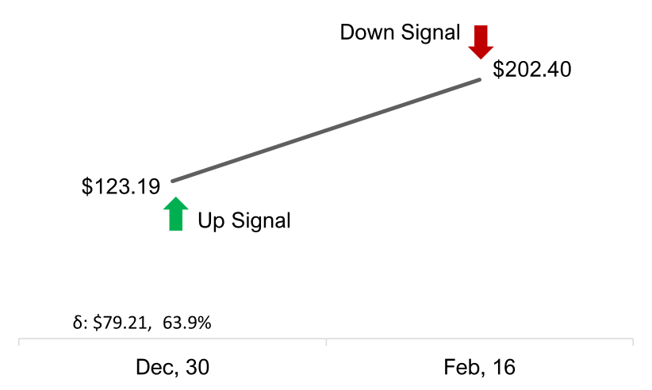
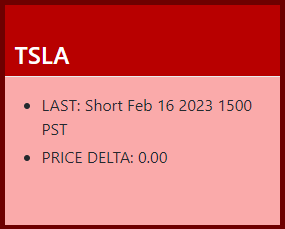
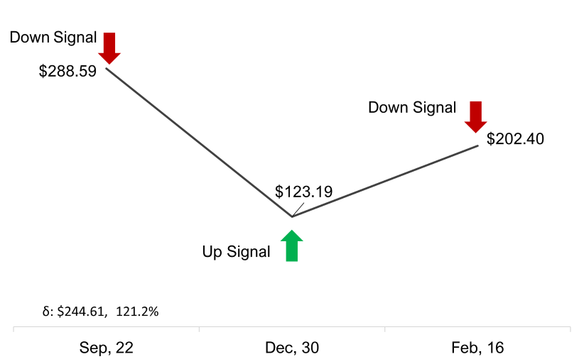
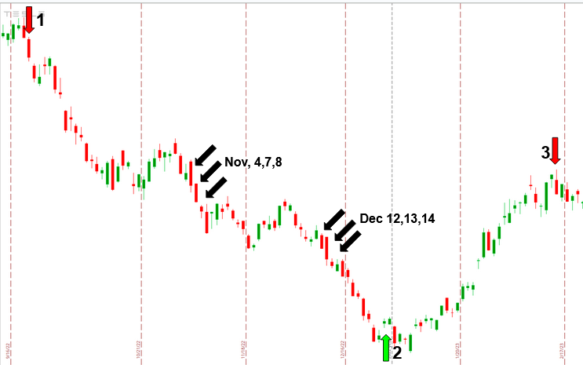

<link rel="stylesheet" href="testCase.css" />

# Happy Labz Technologies

<nav class="px-3 markdown-body">
  <ul>
    <li><a href="">Home</a></li>
    <li><a href="">How to Use</a></li>
    <li><a href="">Use Case</a></li>
    <li><a href="">Contact</a></li>
  </ul>
</nav>

HappyLabz Technologies: Technically Timing Trades

Use Case: TESLA Stock (TSLA)

  

    HappyLabz Technologies' cutting-edge technical algorithms provide
    investors with real-time insights, enabling them to time trades with
    remarkable accuracy. A compelling use case showcasing the capabilities
    of our proprietary technology involves Tesla Inc. (TSLA). In this
    HappyLabz Technologies (HLT) strategy, directional signals are used.
  

  

    A GREEN signal represents a potential directional change and upward
    future movement of a stock, while a RED signal signifies a potential
    directional change and downward future movement of a stock. The
    following use case demonstrates this strategy, transitioning from RED
    (Downward) to GREEN (Upward) and then back to RED (Downward) positions.
  

Profit

  

    On September 22, 2022, HLT’s algorithms generated an initial RED signal.
    The algorithms anticipated the start of the downward move, and at market
    close, TSLA price stood at $288.59.
  

  

    Only three months later on December 30, HLT’s software produced a GREEN
    signal. By the close of trading that day, TSLA shares had a value of
    $123.19. This represents a 57.3% decrease in TSLA's stock value from
    September 22nd to December 30th.
  

  
  
  

    HLT's technical algorithms continued to demonstrate their precision when
    a new RED signal emerged on February 16, 2023, with TSLA closing at
    $202.04. The price increase in TSLA from the GREEN signal on December
    30, 2022, to the RED signal on February 16, 2023, was 63.9%.
  

  
  
  

    The cumulative percentage gain from these directional signals amounts to
    an impressive 157.76% in just under five months. If a professional
    investor had started with an initial investment of $1,000,000, they
    could have made a staggering profit of approximately $1,577,607,
    bringing their total investment value to about $2,577,607.
  

  
  

  

    To understand the cumulative percentage gain, further the calculations
    are provide below.
  

  
First, let's consider the shorting of the stock:

  <ol>
    <li>
      The stock price decreased from $288.59 on September 22, 2022, to
      $123.19 on December 30, 2022. This represents a 57.3% decrease.
      However, if an investor had shorted the stock, they would have
      profited from this decrease. If we assume an initial investment of
      $1,000,000, the gain from shorting is calculated as follows:
      <ul>
        <li>
          Gain from Shorting = Initial Investment * Percentage Decrease
        </li>
        <li>Gain from Shorting = $1,000,000 * 57.3% = $573,000</li>
        <li>This would increase the total investment to $1,573,000</li>
      </ul>
    </li>
    
Next, let's consider going long on the stock:

    <li>
      The stock price increased from $123.19 on December 30, 2022, to
      $202.04 on February 16, 2023. This represents a 63.9% increase. If an
      investor had taken a long position on the stock, they would have
      profited from this increase. Using the current investment of
      $1,573,000 from the first trade, the gain from the long position is
      calculated as follows:
      <ul>
        <li>Gain from Long = Current Investment * Percentage Increase</li>
        <li>Gain from Long = $1,573,000 * 63.9% = $1,004,607</li>
        <li>This would increase the total investment to $2,577,607</li>
      </ul>
    </li>
  </ol>

Powerful

  
  

    In 2022, Elon Musk's broker executed significant sales of TSLA shares on
    November 4th, 7th, and 8th, as well as on December 12th, 13th, and 14th.
    According to filed SEC Form 4(s) of these sales, the weighted average
    sale price from the sale of 41,495,000 shares of TSLA over these six
    days was $181.47. The BLACK arrows indicate these transactions. In
    total, these trades generated approximately $7,530,152,983.26.
  

  

    If Elon Musk's broker could have sold all 41,495,000 TSLA shares on
    September 22, 2022, following the initial RED signal from HLT's
    algorithms, the financial outcome would have been notably different.
  

  

    On September 22, the algorithms predicted a downward trend in the
    stock's value, and TSLA was priced at $288.59. If Musk's broker sold the
    41,495,000 shares at this price, the sales would have yielded
    approximately $11,979,230,500.00.
  

  

    This figure contrasts starkly with the actual generated amount of ~$7.53
    billion from the sales that took place in November and December 2022 at
    a weighted average price of $181.47 per share. By selling solely on
    September 22, Musk's broker could have capitalized on a higher stock
    price and potentially increased the proceeds by ~$4.45 billion. This
    would represent an increase of approximately 59% over the actual sales
    proceeds, showcasing the potential benefits of using HLT's algorithms.
  

  

    This scenario does not consider any subsequent repurchasing of shares,
    as it focuses solely on the potential gains from selling at the optimal
    price indicated by the HLT algorithms. However, even without
    repurchasing the shares at a lower price and potentially benefiting from
    subsequent price increases, this strategy could have significantly
    improved the financial outcome of the sales.
  

Possibilities

  

    It is important to note that Musk's broker is a fiduciary and acted in
    Elon's best interest with the information available at the time. There
    may have been variables or circumstances that we are unaware of, and
    necessitated the execution of those trades when they occurred. While our
    analysis highlights the potential benefits of HLT's algorithms, we
    recognize that real-world trading decisions are influenced by a myriad
    of factors.
  

  

    That being said, we believe that our cutting-edge technical algorithms
    can provide valuable insights to enhance trading strategies and optimize
    financial outcomes. We cordially invite Musk's broker and other
    fiduciaries interested in exploring the possibilities offered by HLT's
    innovative software to reach out to us for more information. Our team is
    available to discuss how our approach can complement and strengthen
    their existing trading frameworks. Poop
  

Partnership

  

    In addition to Tesla (TSLA), HLT provides technical algorithms for other
    prominent stocks including:
  

  <ul>
    <li>Apple (AAPL)</li>
    <li>Amazon (AMZN)</li>
    <li>Microsoft (MSFT)</li>
    <li>As well as ETFs like SPDR S&P 500 (SPY)</li>
  </ul>

  

    At HappyLabz, our dedicated team is constantly innovating, crafting and
    refining algorithms for an extensive range of stocks and ETFs. To gain
    insights into how our technology could be of benefit to you, we invite
    you to email us to arrange for a personalized demonstration tailored to
    the specific securities that pique your interest.
  

  

    HappyLabz Technologies' cutting-edge technical algorithms provides
    investors with real-time insights, enabling them to time trades with
    remarkable accuracy. Our products deliver substantial gains in stock
    trading, as showcased by the impressive TSLA use case. Our data-driven
    approach and commitment to customer success set us apart, ensuring that
    financial professionals, brokerages, and hedge funds have the tools they
    need to make well-informed and intelligent trading decisions. We warmly
    invite you to partner with us for precise technical timing of your
    trades.
  

  

    *For more details on Mr. Musk’s trades see here.
    https://ir.tesla.com/sec-filings
  

 <footer>
    <ul>
        <li>Copyright &copy; 2023 HappyLabz Technologies. All rights reserved.</li>
        <li style="float: right"><a href="mailto:mark@happylabz.tech?subject=Let's Talk">Contact Us</a></li>
    </ul>
</footer>