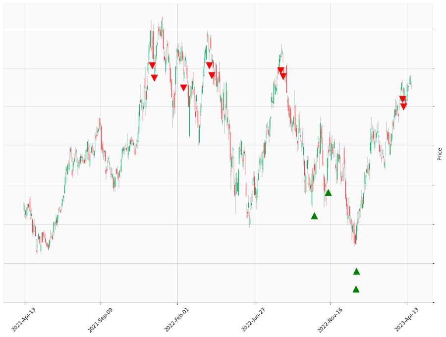

    
# Happy Labz Technologies

### World Class Trading Algorithms
    
<table class="hits">
    <tr>
        <th>Direction</th>
        <th>Date</th>
      </tr>
    <tr>
        <td>Short</td>
        <td>2021-12-14 13:00:00</td>
    </tr>
    <tr>
        <td>Short</td>
        <td>2021-12-17 13:00:00</td>
    </tr>
    <tr>
        <td>Short</td>
        <td>2022-02-11 13:00:00</td>
    </tr>
    <tr>
        <td>Short</td>
        <td>2022-02-11 13:00:00</td>
    </tr>
    <tr>
        <td>Short</td>
        <td>2022-04-01 13:00:00</td>
    </tr>
    <tr>
        <td>Short</td>
        <td>2022-04-06 13:00:00</td>
    </tr>
    <tr>
        <td>Short</td>
        <td>2022-04-06 13:00:00</td>
    </tr>
    <tr>
        <td>Short</td>
        <td>2022-08-16 13:00:00</td>
    </tr>
    <tr>
        <td>Short</td>
        <td>2022-08-19 13:00:00</td>
    </tr>
    <tr>
        <td>Long</td>
        <td>2022-10-18 13:00:00</td>
    </tr>
    <tr>
        <td>Long</td>
        <td>2022-11-11 13:00:00</td>
    </tr>
    <tr>
        <td>Long</td>
        <td>2023-01-05 13:00:00</td>
    </tr>
    <tr>
        <td>Long</td>
        <td>2023-01-06 13:00:00</td>
    </tr>
    <tr>
        <td>Long</td>
        <td>2023-01-06 13:00:00</td>
    </tr>
    <tr>
        <td>Short</td>
        <td>2023-04-04 13:00:00</td>
    </tr>
    <tr>
        <td>Short</td>
        <td>2023-04-05 13:00:00</td>
    </tr>
    
</table>

