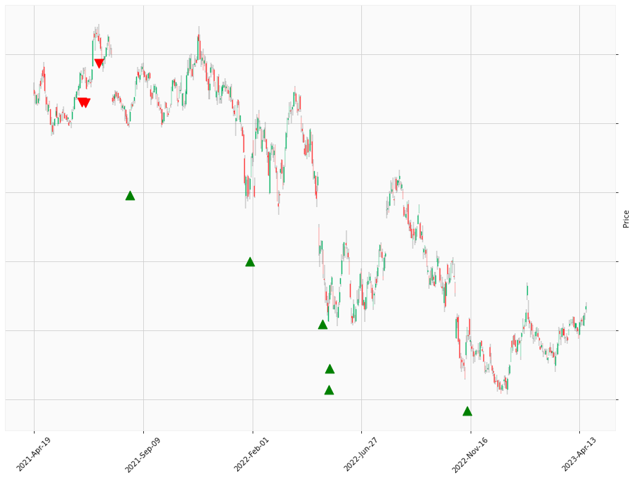

    
# Happy Labz Technologies

### World Class Trading Algorithms
    
<table class="hits">
    <tr>
        <th>Direction</th>
        <th>Date</th>
      </tr>
    <tr>
        <td>Short</td>
        <td>2021-06-21 13:00:00</td>
    </tr>
    <tr>
        <td>Short</td>
        <td>2021-06-24 13:00:00</td>
    </tr>
    <tr>
        <td>Short</td>
        <td>2021-07-13 13:00:00</td>
    </tr>
    <tr>
        <td>Long</td>
        <td>2021-08-23 13:00:00</td>
    </tr>
    <tr>
        <td>Long</td>
        <td>2021-08-23 13:00:00</td>
    </tr>
    <tr>
        <td>Long</td>
        <td>2021-08-23 13:00:00</td>
    </tr>
    <tr>
        <td>Long</td>
        <td>2022-01-28 13:00:00</td>
    </tr>
    <tr>
        <td>Long</td>
        <td>2022-01-28 13:00:00</td>
    </tr>
    <tr>
        <td>Long</td>
        <td>2022-05-04 13:00:00</td>
    </tr>
    <tr>
        <td>Long</td>
        <td>2022-05-12 13:00:00</td>
    </tr>
    <tr>
        <td>Long</td>
        <td>2022-05-13 13:00:00</td>
    </tr>
    <tr>
        <td>Long</td>
        <td>2022-05-13 13:00:00</td>
    </tr>
    <tr>
        <td>Long</td>
        <td>2022-05-13 13:00:00</td>
    </tr>
    <tr>
        <td>Long</td>
        <td>2022-11-11 13:00:00</td>
    </tr>
    <tr>
        <td>Long</td>
        <td>2022-11-11 13:00:00</td>
    </tr>
    
</table>

