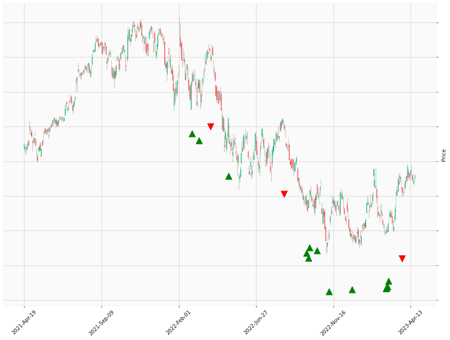

    
# Happy Labz Technologies

### World Class Trading Algorithms
    
<table class="hits">
    <tr>
        <th>Direction</th>
        <th>Date</th>
      </tr>
    <tr>
        <td>Long</td>
        <td>2022-02-25 13:00:00</td>
    </tr>
    <tr>
        <td>Long</td>
        <td>2022-02-25 13:00:00</td>
    </tr>
    <tr>
        <td>Long</td>
        <td>2022-02-25 13:00:00</td>
    </tr>
    <tr>
        <td>Long</td>
        <td>2022-02-25 13:00:00</td>
    </tr>
    <tr>
        <td>Long</td>
        <td>2022-03-10 13:00:00</td>
    </tr>
    <tr>
        <td>Short</td>
        <td>2022-03-31 13:00:00</td>
    </tr>
    <tr>
        <td>Short</td>
        <td>2022-03-31 13:00:00</td>
    </tr>
    <tr>
        <td>Long</td>
        <td>2022-05-04 13:00:00</td>
    </tr>
    <tr>
        <td>Short</td>
        <td>2022-08-17 13:00:00</td>
    </tr>
    <tr>
        <td>Short</td>
        <td>2022-08-17 13:00:00</td>
    </tr>
    <tr>
        <td>Long</td>
        <td>2022-09-28 13:00:00</td>
    </tr>
    <tr>
        <td>Long</td>
        <td>2022-10-03 13:00:00</td>
    </tr>
    <tr>
        <td>Long</td>
        <td>2022-10-04 13:00:00</td>
    </tr>
    <tr>
        <td>Long</td>
        <td>2022-10-04 13:00:00</td>
    </tr>
    <tr>
        <td>Long</td>
        <td>2022-10-18 13:00:00</td>
    </tr>
    <tr>
        <td>Long</td>
        <td>2022-11-08 13:00:00</td>
    </tr>
    <tr>
        <td>Long</td>
        <td>2022-12-21 13:00:00</td>
    </tr>
    <tr>
        <td>Long</td>
        <td>2023-02-27 13:00:00</td>
    </tr>
    <tr>
        <td>Long</td>
        <td>2023-02-28 13:00:00</td>
    </tr>
    <tr>
        <td>Long</td>
        <td>2023-03-01 13:00:00</td>
    </tr>
    <tr>
        <td>Long</td>
        <td>2023-03-01 13:00:00</td>
    </tr>
    <tr>
        <td>Long</td>
        <td>2023-03-02 13:00:00</td>
    </tr>
    <tr>
        <td>Short</td>
        <td>2023-03-28 13:00:00</td>
    </tr>
    <tr>
        <td>Short</td>
        <td>2023-03-28 13:00:00</td>
    </tr>
    
</table>

