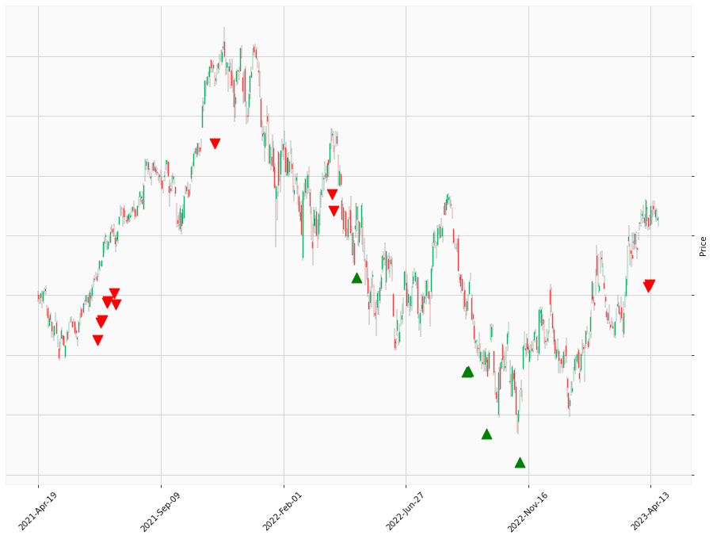

    
# Happy Labz Technologies

### World Class Trading Algorithms
    
<table class="hits">
    <tr>
        <th>Direction</th>
        <th>Date</th>
      </tr>
    <tr>
        <td>Short</td>
        <td>2021-06-25 13:00:00</td>
    </tr>
    <tr>
        <td>Short</td>
        <td>2021-06-30 13:00:00</td>
    </tr>
    <tr>
        <td>Short</td>
        <td>2021-07-01 13:00:00</td>
    </tr>
    <tr>
        <td>Short</td>
        <td>2021-07-08 13:00:00</td>
    </tr>
    <tr>
        <td>Short</td>
        <td>2021-07-09 13:00:00</td>
    </tr>
    <tr>
        <td>Short</td>
        <td>2021-07-16 13:00:00</td>
    </tr>
    <tr>
        <td>Short</td>
        <td>2021-07-19 13:00:00</td>
    </tr>
    <tr>
        <td>Short</td>
        <td>2021-11-10 13:00:00</td>
    </tr>
    <tr>
        <td>Short</td>
        <td>2022-03-30 13:00:00</td>
    </tr>
    <tr>
        <td>Short</td>
        <td>2022-03-31 13:00:00</td>
    </tr>
    <tr>
        <td>Short</td>
        <td>2022-03-31 13:00:00</td>
    </tr>
    <tr>
        <td>Long</td>
        <td>2022-04-28 13:00:00</td>
    </tr>
    <tr>
        <td>Long</td>
        <td>2022-04-28 13:00:00</td>
    </tr>
    <tr>
        <td>Long</td>
        <td>2022-09-07 13:00:00</td>
    </tr>
    <tr>
        <td>Long</td>
        <td>2022-09-08 13:00:00</td>
    </tr>
    <tr>
        <td>Long</td>
        <td>2022-09-08 13:00:00</td>
    </tr>
    <tr>
        <td>Long</td>
        <td>2022-09-29 13:00:00</td>
    </tr>
    <tr>
        <td>Long</td>
        <td>2022-11-07 13:00:00</td>
    </tr>
    <tr>
        <td>Short</td>
        <td>2023-04-11 13:00:00</td>
    </tr>
    <tr>
        <td>Short</td>
        <td>2023-04-12 13:00:00</td>
    </tr>
    
</table>

