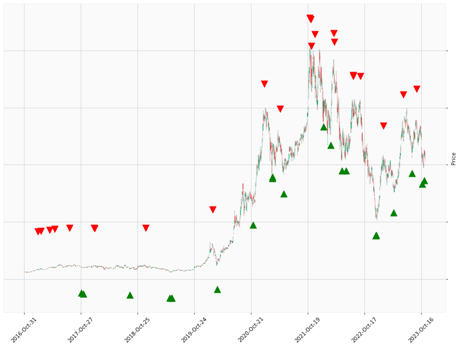

    
# Happy Labz Technologies

### World Class Trading Algorithms
    
<table class="hits">
    <tr>
        <th>Direction</th>
        <th>Date</th>
      </tr>
    <tr>
        <td>Short</td>
        <td>2021-11-02 13:00:00</td>
    </tr>
    <tr>
        <td>Short</td>
        <td>2021-11-08 13:00:00</td>
    </tr>
    <tr>
        <td>Short</td>
        <td>2021-11-08 13:00:00</td>
    </tr>
    <tr>
        <td>Short</td>
        <td>2021-11-08 13:00:00</td>
    </tr>
    <tr>
        <td>Short</td>
        <td>2021-11-09 13:00:00</td>
    </tr>
    <tr>
        <td>Short</td>
        <td>2021-12-02 13:00:00</td>
    </tr>
    <tr>
        <td>Long</td>
        <td>2022-03-16 13:00:00</td>
    </tr>
    <tr>
        <td>Short</td>
        <td>2022-04-05 13:00:00</td>
    </tr>
    <tr>
        <td>Short</td>
        <td>2022-04-05 13:00:00</td>
    </tr>
    <tr>
        <td>Short</td>
        <td>2022-04-06 13:00:00</td>
    </tr>
    <tr>
        <td>Short</td>
        <td>2022-04-06 13:00:00</td>
    </tr>
    <tr>
        <td>Long</td>
        <td>2022-05-26 13:00:00</td>
    </tr>
    <tr>
        <td>Long</td>
        <td>2022-05-26 13:00:00</td>
    </tr>
    <tr>
        <td>Long</td>
        <td>2022-05-26 13:00:00</td>
    </tr>
    <tr>
        <td>Long</td>
        <td>2022-06-22 13:00:00</td>
    </tr>
    <tr>
        <td>Short</td>
        <td>2022-08-05 13:00:00</td>
    </tr>
    <tr>
        <td>Short</td>
        <td>2022-08-08 13:00:00</td>
    </tr>
    <tr>
        <td>Short</td>
        <td>2022-08-08 13:00:00</td>
    </tr>
    <tr>
        <td>Short</td>
        <td>2022-09-22 13:00:00</td>
    </tr>
    <tr>
        <td>Short</td>
        <td>2022-09-22 13:00:00</td>
    </tr>
    <tr>
        <td>Long</td>
        <td>2022-12-30 13:00:00</td>
    </tr>
    <tr>
        <td>Long</td>
        <td>2022-12-30 13:00:00</td>
    </tr>
    <tr>
        <td>Short</td>
        <td>2023-02-16 13:00:00</td>
    </tr>
    
</table>

